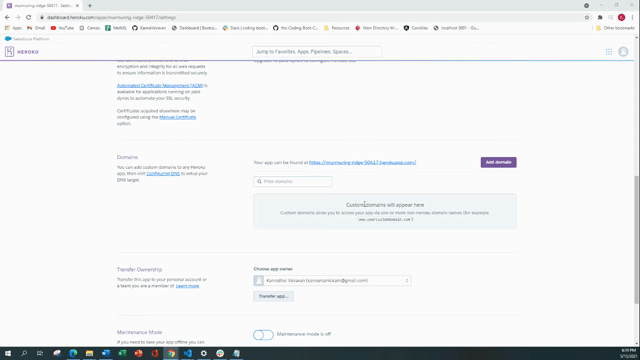

# Employee Directory

## User Story

- As a user, I want to be able to view my entire employee directory at once so that I have quick access to their information.

## Summary

This application renders employee directory from https://randomuser.me/ API. The user has option to sort and filter employee name. This app is built using React.
axios NPM package is needed to fetch the API. This site is deployed to Heroku.

## Installation:

Clone the repository https://github.com/KannaVairavan/React_Employee_Directory.git
run npm i to install dependencies.

## Acceptance Criteria

```md
Given a table of random users generated from the [Random User API](https://randomuser.me/), when the user loads the page, a table of employees should render.

The user should be able to:

- Sort the table by at least one category

- Filter the users by at least one property.
```

## Project Demo

<br>

Below is the walkthrough video that demonstrates the functionality of theEmployee Directory app.
<br/>
<br/>


## Repository

https://github.com/KannaVairavan/React_Employee_Directory.git

## Deployed Heroku App

https://murmuring-ridge-50417.herokuapp.com/
